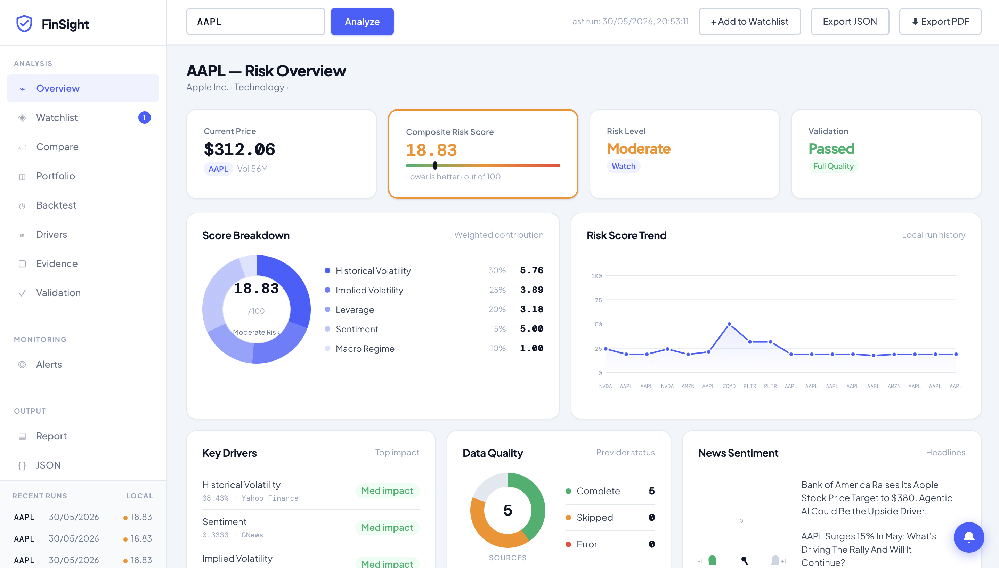

# Nexus — Agentic Financial Risk Intelligence

> **Live demo:** [nexus-fcpq.vercel.app](https://nexus-fcpq.vercel.app)



---

## Overview

Nexus is an agentic financial risk intelligence platform that synthesises five real-time data streams — market data, options implied volatility, SEC filings, news sentiment, and macro context — into a composite risk score with a structured recommendation. Unlike conventional screeners, Nexus runs a multi-source quantitative layer (RSI, momentum, Groq-powered semantic NLP) before passing a draft report into a LangGraph-orchestrated judge-refine loop, where an LLM critic scores the report, flags hallucinations and sentiment bias, and triggers iterative refinement until quality thresholds are met.

The system is built as a production-grade FastAPI service with a LangGraph state machine at its core, Pydantic-enforced schema validation throughout the pipeline, and ChromaDB for semantic search over historical run memory. The frontend delivers a real-time analyst dashboard with severity-tiered alerting, portfolio-level batch analysis, PDF export, watchlist monitoring with scheduled re-analysis, and a backtesting view — all driven by a vanilla JS rendering engine against a REST API. The architecture demonstrates the full agentic engineering stack: multi-source orchestration, LLM-as-judge quality control, structured output enforcement, and a self-correcting feedback loop that validates results before they reach the analyst.

---

## Architecture

```
┌─────────────────────────────────────────────────────────┐
│                     Data Ingestion                       │
│  Market Data · Options IV · SEC/MD&A · News · Macro     │
│              (parallel, ThreadPoolExecutor)              │
└────────────────────────┬────────────────────────────────┘
                         │
┌────────────────────────▼────────────────────────────────┐
│                   Quant Signals                          │
│         RSI · Momentum · Macro overlay (deterministic)  │
└────────────────────────┬────────────────────────────────┘
                         │
┌────────────────────────▼────────────────────────────────┐
│              LLM Risk Synthesis  (Groq)                  │
│   Structured RiskReport JSON · Pydantic validation       │
└────────────────────────┬────────────────────────────────┘
                         │
┌────────────────────────▼────────────────────────────────┐
│           Agentic Judge-Refine Loop (LangGraph)          │
│                                                          │
│   ┌─────────┐    ┌─────────┐    ┌──────────────────┐   │
│   │  Judge  │───▶│ Refine  │───▶│ Halluc + Bias    │   │
│   │  (LLM)  │◀───│  (LLM)  │    │    Audit         │   │
│   └─────────┘    └─────────┘    └──────────────────┘   │
│         score < 4 → refine · score ≥ 4 → finalize       │
└────────────────────────┬────────────────────────────────┘
                         │
┌────────────────────────▼────────────────────────────────┐
│                    Dashboard                             │
│   Risk overview · Score breakdown · Quant signals        │
│   News sentiment · Watchlist · Portfolio · Backtest      │
└─────────────────────────────────────────────────────────┘
```

---

## Features

**Analysis pipeline**
- Five parallel data providers: Yahoo Finance (market + options IV), SEC EDGAR (10-K/MD&A), GNews (headlines), Yahoo Finance Macro (VIX, 10Y yield, S&P return)
- Deterministic quant signals: RSI classification, momentum, macro-adjusted signal
- Groq LLM risk synthesis grounded in MD&A language where available
- Composite risk score (0–100) with weighted factor breakdown

**Agentic quality loop**
- LLM-as-judge scoring (1–5) against completeness, consistency, actionability, data grounding
- Automatic refinement iteration when score falls below threshold
- Deterministic hallucination pre-check (numeric claim validation against source data)
- Qualitative hallucination detection via LLM
- Sentiment bias audit: flags when recommendation contradicts fundamentals
- Compliance filter: redacts prohibited financial claim language

**Dashboard**
- Severity-tiered alert system (critical / warning / info) — hard failures look different from routine caveats
- Risk score trend chart across run history
- Score breakdown donut chart with weighted factor contributions
- Headline classifications with Groq semantic labels and confidence
- Collapsible pipeline debug drawer (token costs, refinement iterations)
- Watchlist with scheduled re-analysis
- Portfolio batch analysis (up to 10 tickers)
- Semantic search over historical reports (ChromaDB)
- JSON and PDF export

---

## Tech stack

| Layer | Technology |
|---|---|
| API | FastAPI |
| Agentic orchestration | LangGraph |
| LLM | Groq (llama-3.3-70b-versatile) |
| LLM client | LangChain-Groq |
| Schema validation | Pydantic v2 |
| Vector store | ChromaDB |
| Market data | yfinance |
| News | GNews API |
| SEC filings | EDGAR REST API |
| Frontend | Vanilla JS |
| Deployment | Vercel |

---

## Local setup

```bash
git clone https://github.com/ibromodzi/nexus.git
cd nexus

python -m venv .venv
source .venv/bin/activate

pip install -e ".[dev]"
```

Create a `.env` file at the project root:

```
GROQ_API_KEY=your_groq_key
GNEWS_API_KEY=your_gnews_key
```

Start the server:

```bash
uvicorn finsight_app.main:app --reload
```

Open [http://localhost:8000](http://localhost:8000).

---

## Project structure

```
nexus/
├── finsight/
│   ├── engine/
│   │   ├── pipeline.py       # LangGraph state machine + all nodes
│   │   ├── models.py         # Pydantic schemas
│   │   ├── scoring.py        # Composite score computation
│   │   ├── validation.py     # Hallucination checks
│   │   ├── persistence.py    # ChromaDB + run history
│   │   └── cost.py           # Token budget tracker
│   ├── data/
│   │   ├── market.py         # Yahoo Finance market + IV
│   │   ├── news.py           # GNews + Groq semantic classification
│   │   ├── sec.py            # SEC EDGAR 10-K/MD&A
│   │   └── macro.py          # Macro context
│   ├── llm/
│   │   └── client.py         # call_llm_json + enum normalisation
│   ├── reports/
│   │   ├── formatter.py
│   │   └── pdf_export.py
│   └── config.py
├── finsight_app/
│   └── main.py               # FastAPI app + routes
├── static/
│   ├── index.html
│   ├── app.js
│   └── styles.css
├── pyproject.toml
└── vercel.json
```

---

## Key engineering decisions

**Why LangGraph over a plain loop?** The judge-refine cycle has conditional branching (score ≥ 4 → hallucination check, score = 1 → finalize, budget exceeded → finalize). LangGraph makes the routing explicit, inspectable, and easy to extend — adding a new node (e.g. a fact-retrieval step) is a single `add_node` + `add_edge` call.

**Why deterministic quant signals instead of LLM?** RSI, momentum, and macro overlay are pure arithmetic on structured data. Delegating them to an LLM adds latency, cost, and a failure mode with no quality upside. The deterministic path is always used; the LLM handles qualitative synthesis where it actually adds value.

**Pydantic enum normalisation in `call_llm_json`:** LLMs reliably hallucinate enum synonyms (`"medium"` for `"moderate"`, `"complete"` for `"full"`). Rather than patching each prompt, `_normalise_enums()` introspects the schema via `model_json_schema()` and applies a synonym map + fuzzy match before every validation call — making the fix generic across all nodes.

---

## Author

**Dhikrullah Ibromodzi**
Optometrist · Clinical NLP Researcher · ML Engineer
[GitHub](https://github.com/ibromodzi) · [LinkedIn](https://linkedin.com/in/ibromodzi)